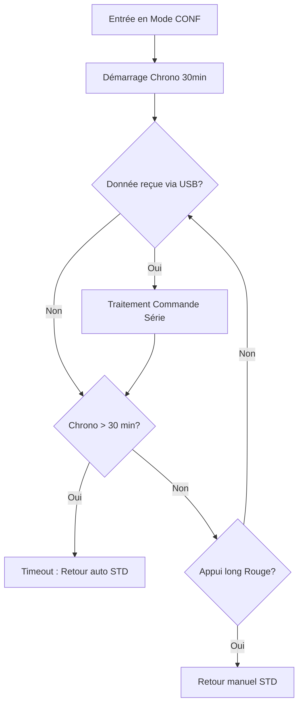

```mermaid
graph TD
    A[Entrée en Mode CONF] --> B[Démarrage Chrono 30min]
    B --> C{Donnée reçue via USB?}
    C -- Oui --> D[Traitement Commande Série]
    C -- Non --> E{Chrono > 30 min?}
    D --> E
    E -- Oui --> F[Timeout : Retour auto STD]
    E -- Non --> G{Appui long Rouge?}
    G -- Oui --> H[Retour manuel STD]
    G -- Non --> C
```
