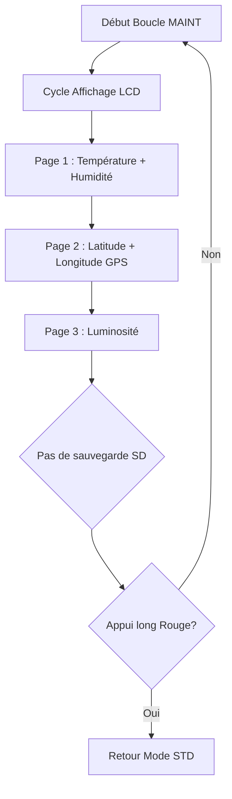

```mermaid
graph TD
    A[Début Boucle MAINT] --> B[Cycle Affichage LCD]
    B --> C[Page 1 : Température + Humidité]
    C --> D[Page 2 : Latitude + Longitude GPS]
    D --> E[Page 3 : Luminosité]
    E --> F{Pas de sauvegarde SD}
    F --> G{Appui long Rouge?}
    G -- Oui --> H[Retour Mode STD]
    G -- Non --> A
```
