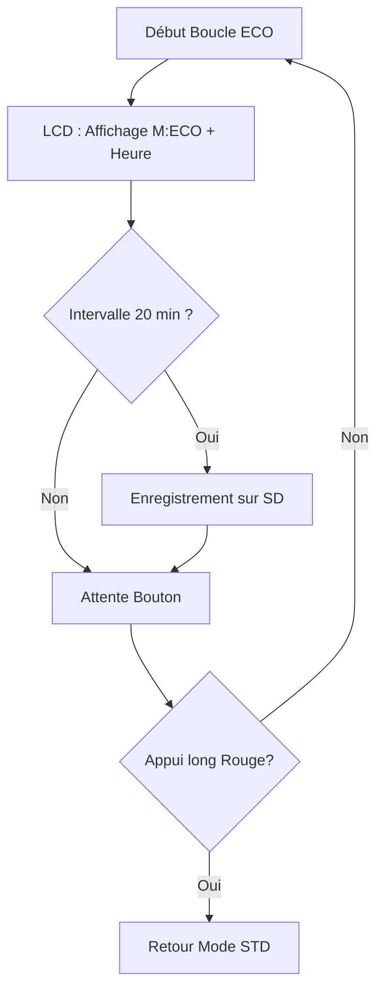

```mermaid
graph TD
    A[Début Boucle ECO] --> B[LCD : Affichage M:ECO + Heure]
    B --> C{Intervalle 20 min ?}
    C -- Oui --> D[Enregistrement sur SD]
    C -- Non --> E[Attente Bouton]
    D --> E
    E --> F{Appui long Rouge?}
    F -- Oui --> G[Retour Mode STD]
    F -- Non --> A
```
